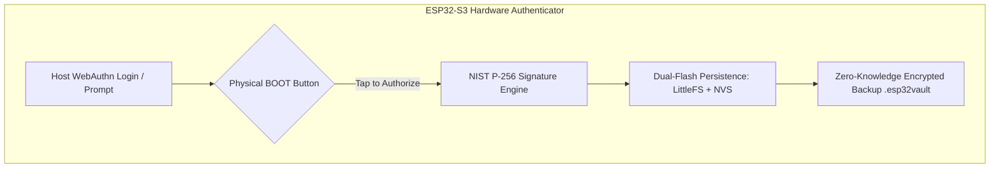
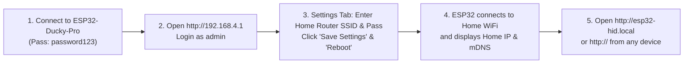

# ESP32-S3 HID Console & KVM Bridge (R8N16)

A professional web-based USB HID injection engine and ultra-low latency KVM bridge built for the **ESP32-S3 N16R8** (16 MB Flash, 8 MB Octal PSRAM).

---

### Table of Contents
- [Highlights & Features](#highlights--features)
- [FIDO2 Hardware Passkeys & Encrypted Vault](#fido2-hardware-passkeys--encrypted-vault)
- [System Architecture](#system-architecture)
- [Quick Start Guide](#quick-start-guide)
- [Network Access & IP Discovery](#network-access--ip-discovery)
- [Ducky Script Syntax Reference](#ducky-script-syntax-reference)
- [Universal Cross-Platform KVM Client (`esp32_kvm.py`)](#universal-cross-platform-kvm-client-esp32_kvmpy)
- [Hardware Absolute Mouse & Resolution Independence](#hardware-absolute-mouse--resolution-independence)
- [Action Recorder & Replay Engine](#action-recorder--replay-engine)
- [Typing Engine Tuning Guide](#typing-engine-tuning-guide)
- [Web OTA Updates](#web-ota-updates)
- [REST API Reference](#rest-api-reference)
- [Security & Reverse Proxy](#security--reverse-proxy)
- [USB Identity Spoofing](#usb-identity-spoofing)

---

## Highlights & Features

- **FIDO2 / WebAuthn Hardware Security Key**:
  - Full W3C WebAuthn & CTAP 2.0 / 2.1 compliance (NIST P-256 ECC, SHA-256, HMAC-secret PRF).
  - Compatible with Google, GitHub, Apple, Microsoft, Bitwarden, 1Password, Windows Hello, and Android Google Play Services.
  - Dedicated Passkey Mode with 2.5s physical `BOOT` button gesture toggling.
- **Zero-Knowledge Encrypted Vault & 2FA Authenticator**:
  - Encrypted with **AES-256-GCM** and **PBKDF2-HMAC-SHA256** (100,000 iterations).
  - Live 2FA TOTP code generator with auto-typing and auto-fill.
  - **Zero-Knowledge Encrypted Backup & Restore (`.esp32vault`)**: 1-click export and import of all 2FA accounts and FIDO2 passkeys with dual NVS flash persistence.
- **Hardware USB HID Absolute Mouse (`0..32767`)**:
  - Embedded hardware Absolute Mouse descriptor alongside standard relative mouse.
  - `(0,0)` is always top-left and `(32767,32767)` is always bottom-right across **all OSes, display scalings, and resolutions**.
- **Universal Single-File KVM Client (`esp32_kvm.py`)**:
  - Standalone, ultra-lightweight (<30 KB) Python script running across Linux (Wayland/X11), Windows, and macOS.
  - Direct Linux kernel `evdev` integration for 0ms low-level key & mouse capture under Wayland.
  - Live Mouse & Keyboard Macro Recorder, Action Replayer, and Clipboard Typer.
- **Dual-Core FreeRTOS Architecture**: Core 1 handles heavy script parsing and 2 MB PSRAM payload streaming, while Core 0 runs real-time USB HID events and UDP network ingestion.
- **Home WiFi & Auto IP Discovery**:
  - Automatically displays assigned Home WiFi IP (Station), Direct AP IP, Gateway, and live RSSI signal strength.
  - Built-in **mDNS responder**: Access directly via **`http://esp32-hid.local`** without knowing numerical IP addresses.
- **Full Ducky Script 2.0 / BadUSB Engine**:
  - Full support for `REPEAT <n>`, `BLOCK...ENDBLOCK` raw text injection, function keys `F1`–`F12`, navigation keys, and compound combinations (`CTRL ALT DELETE`, `CTRL SHIFT ESC`, `ALT F4`, `GUI SHIFT S`).
- **Low-Latency KVM Bridge (16-byte UDP Protocol)**:
  - 16-byte binary UDP protocol (`0xCAFE`) for mouse/keyboard/multimedia streaming.
  - Automatic sequence resynchronization on host restart and a 1.5s stuck-key safety watchdog.
- **Virtual Touch 65% Keyboard & Trackpad**:
  - Touch-friendly on-screen keyboard with sticky modifier locks and relative trackpad with scroll gesture.
- **Web-Based OTA Updates**:
  - Flash firmware (`firmware.bin`) and LittleFS filesystems (`littlefs.bin`) directly through the browser without USB cables.
- **Action Recorder & Replay**:
  - Record keyboard and mouse movements from the Web UI or KVM stream, save to `/actions`, and replay at full hardware speed.
- **USB Hardware Spoofing**:
  - Custom Vendor ID, Product ID, Manufacturer Name, and Product Name (with presets for Espressif, Logitech, Microsoft, Arduino, Adafruit).
- **Single-Operator Session & Brute-Force Rate Limiting**:
  - Cookie-based authentication preventing multiple concurrent operators and IP-based exponential backoff rate limiting.

---

## FIDO2 Hardware Passkeys & Encrypted Vault

The ESP32-S3 functions as a **standalone FIDO2 / WebAuthn physical security key** (similar to a YubiKey 5 Series) combined with a **Zero-Knowledge Encrypted Software Vault**:



### Key Capabilities:
1. **Physical Presence (`BOOT` Button Gesture)**:
   - When a website requests a passkey login or registration, the ESP32 waits for physical touch on the **`BOOT` button**.
   - **Mode Toggle Gesture**: Hold the physical `BOOT` button for **2.5 seconds** anytime to switch between **💻 Normal Ducky Mode** (Green LED) and **🛡️ Dedicated Passkey Mode** (Neon Cyan LED).
2. **Biometric UV Emulation Toggle (`uv: true`)**:
   - Easily toggle between **Standard Roaming Key (`uv: false`)** and **Emulated Biometric Verification (`uv: true`)** from the Web Vault dashboard. Changes dynamically in 0ms without rebooting!
3. **Hardware PIN Management**:
   - Configure a 4–8 digit hardware PIN with automatic lockout counters (8 retries) to protect against unauthorized physical use.
4. **Encrypted Backup & Restore (`.esp32vault`)**:
   - Export an **AES-256-GCM** encrypted binary backup containing all 2FA TOTP secret keys, passwords, and FIDO2 resident passkeys.
   - Restore on any ESP32-S3 with zero risk of credential loss.

> 📖 **Full User Guide**: See [docs/FIDO2_PASSKEY_USER_GUIDE.md](docs/FIDO2_PASSKEY_USER_GUIDE.md) for step-by-step registration guides, Android setup, PIN management, and backup instructions.

---

## System Architecture

```text
ESP32-S3 Project Structure:
├── boards/
│   └── esp32-s3-devkitc-1-n16r8.json    # Board definition (16MB Flash, 8MB OPI PSRAM)
├── data/                               # LittleFS Web UI Assets
│   ├── app.html                        # Main single-page console UI
│   ├── app.js                          # Web client application logic
│   ├── esp32_kvm.py                    # Universal single-file cross-platform KVM client
│   ├── login.html                      # Single-operator login page
│   └── styles.css                      # Modern dark theme stylesheet
├── server/                             # Standalone Host Utilities (Python)
│   ├── esp32_kvm.py                    # Universal KVM Client & Macro Engine
│   └── target_screenshot_server.py     # Lightweight screenshot agent
├── src/
│   └── main.cpp                        # Dual-core firmware source code (FIDO2 + HID + Web)
├── partitions.csv                      # Partition table (OTA0: 3MB, OTA1: 3MB, LittleFS: 9MB)
├── platformio.ini                      # PlatformIO project configuration
└── README.md                           # Documentation
```

---

## Quick Start Guide

### 1. Build & Flash Firmware (Initial USB Setup)
Connect the ESP32-S3 board to your PC via the **native USB port** and run:

```bash
# 1. Build and flash firmware binary
pio run -t upload

# 2. Upload Web UI files to LittleFS (required)
pio run -t uploadfs
```

### 2. Default Access Credentials
- **Access Point SSID**: `ESP32-Ducky-Pro`
- **AP Password**: `password123`
- **Default AP URL**: `http://192.168.4.1`
- **Default Username**: `admin`
- **Default Password**: `admin123`

---

## Network Access & IP Discovery

Once the device is flashed, you can connect it to your home/office WiFi to access it from any device on your local network.



### Accessing via mDNS (No IP Required)
Because mDNS is built-in, you can open:
```text
http://esp32-hid.local
```
*(Supported natively on Windows 10/11, macOS, iOS, Android, and Linux).*

### Finding the Assigned Home IP
1. In the **Settings** tab, view the **"Device Access & IP Addresses"** dashboard.
2. It displays:
   - **Home WiFi IP (Station)**: The assigned local IP (e.g. `192.168.1.55`) with **Copy Link** and **Open** buttons.
   - **Direct AP IP**: `192.168.4.1` (always available as a direct access point fallback).
   - **Signal & Gateway**: Live WiFi RSSI in dBm and router gateway.
   - **Top Navigation Bar**: Live IP pill in the top-right corner.

---

## Ducky Script Syntax Reference

The onboard interpreter executes scripts from the web editor or directly from `/scripts` in LittleFS.

### Basic Commands
| Command | Description | Example |
| :--- | :--- | :--- |
| `REM` | Comment / remarks (ignored) | `REM This is a comment` |
| `STRING <text>` | Types text with configured typing delay | `STRING Hello World!` |
| `STRINGLN <text>` | Types text followed by Enter | `STRINGLN notepad.exe` |
| `DELAY <ms>` | Pauses execution for $N$ milliseconds | `DELAY 500` |
| `DEFAULT_DELAY <ms>` | Sets delay between every subsequent command | `DEFAULT_DELAY 50` |
| `REPEAT <n>` | Repeats the previous command $n$ times | `REPEAT 5` |
| `BLOCK` ... `ENDBLOCK` | Injects raw text block at maximum throughput | `BLOCK`<br>`Multi-line script`<br>`ENDBLOCK` |
| `MOUSE_MOVE_ABS <x%> <y%>` | Moves cursor to exact screen percentage ($0..100\%$) via hardware Absolute Mouse | `MOUSE_MOVE_ABS 50 50` |
| `MOUSE_CLICK_ABS <btn> <x%> <y%>` | Moves and clicks at exact screen percentage | `MOUSE_CLICK_ABS left 50 50` |

### Special & Navigation Keys
- `ENTER` / `RETURN`
- `TAB`
- `ESC` / `ESCAPE`
- `BACKSPACE`
- `DELETE` / `DEL`
- `INSERT` / `INS`
- `UP` / `DOWN` / `LEFT` / `RIGHT` (or `UPARROW`, `DOWNARROW`, etc.)
- `PAGEUP` / `PAGEDOWN`
- `HOME` / `END`
- `CAPSLOCK` / `NUMLOCK` / `SCROLLLOCK`
- `PRINTSCREEN`
- `PAUSE` / `BREAK`
- `APP` / `MENU`
- `SPACE`
- `F1` through `F12`

### Modifiers & Combinations
Combine modifiers (`CTRL`, `ALT`, `SHIFT`, `GUI` / `WINDOWS`) with any key or function key:

```text
GUI r
DELAY 300
STRINGLN powershell
DELAY 1000
CTRL ALT DELETE
CTRL SHIFT ESC
ALT F4
CTRL+ALT+T
GUI SHIFT S
```

---

## Universal Cross-Platform KVM Client (`esp32_kvm.py`)

A single-file (<30 KB), zero-latency KVM transmitter, live macro recorder, and replay engine that runs on **Linux (Wayland & X11)**, **Windows**, and **macOS**.

### Features:
- **Low-Latency UDP Stream**: 16-byte binary UDP packets (`0xCAFE` magic).
- **Native Linux Kernel `evdev` Support**: Bypasses Wayland security sandboxing to capture global inputs with 0ms latency.
- **Action Macro Recorder**: Live record keystrokes and mouse movements into ESP32-compatible `.txt` action files.
- **Hardware Absolute Mouse Recording**: Record resolution-independent coordinates (`0..32767`).
- **Clipboard Typer**: Direct keystroke typing from local clipboard via `Ctrl+Alt+V`.
- **Screen Preview Server**: Built-in HTTP screenshot server (`--preview`, port 8080).

### Usage:

#### 1. Start KVM Client (Standard Live Forwarding)
```bash
# On Linux (Wayland / X11)
sudo python3 data/esp32_kvm.py --ip 192.168.4.1

# On Windows / macOS
python data/esp32_kvm.py --ip 192.168.4.1
```

#### 2. Hotkeys & Controls
- **`[F8]`**: Toggle KVM Mode (**ON** ➔ forwards mouse/keyboard to target; **OFF** ➔ host PC active).
- **`[F9]`**: Start / Stop Macro Recording (saves directly to `macro_XXXXX.txt`).
- **`[Ctrl + Alt + V]`**: Type host clipboard text directly into target machine.
- **`[Ctrl + C]`**: Exit KVM client.

#### 3. Resolution-Independent Absolute Mouse Recording (`--abs-mouse`)
Records coordinates normalized to `0..32767`, ensuring macros click the exact same UI buttons across **different screen resolutions, display scalings, and OSes**:
```bash
sudo python3 data/esp32_kvm.py --ip 192.168.4.1 --abs-mouse --screen-width 1920 --screen-height 1080
```

#### 4. Replay Macro Locally via UDP (`--replay`)
```bash
# Replay binary .krec macro
sudo python3 data/esp32_kvm.py --ip 192.168.4.1 --replay macro_1786988589.krec

# Replay with movement scaling (e.g. 70% speed / sensitivity adjustment)
sudo python3 data/esp32_kvm.py --ip 192.168.4.1 --replay macro_1786988589.krec --mouse-scale 0.7
```

#### 5. Inspect & Convert Macros (`--view`, `--to-txt`, `--to-krec`)
```bash
# Print a formatted table of all events in a binary .krec file:
python3 data/esp32_kvm.py --view macro.krec

# Convert binary .krec to readable .txt:
python3 data/esp32_kvm.py --to-txt macro.krec -o macro.txt

# Convert readable .txt to optimized binary .krec:
python3 data/esp32_kvm.py --to-krec macro.txt -o macro.krec
```

---

## Hardware Absolute Mouse & Resolution Independence

The ESP32-S3 firmware includes a **dedicated USB HID Absolute Mouse** report descriptor alongside the standard relative mouse:

- Coordinate space: `X: 0..32767`, `Y: 0..32767`.
- `(0, 0)` is **always top-left corner**.
- `(32767, 32767)` is **always bottom-right corner**.
- **100% immune** to OS mouse acceleration curves, pointer sensitivity settings, and monitor resolution differences.

---

## Action Recorder & Binary `.krec` Format

Action macros are recorded and executed using the **`.krec` binary stream format** directly in ESP32 hardware memory without string parsing overhead.

### Binary `.krec` Structure:
- **Header (8 bytes)**:
  - `magic` (4 bytes): `KREC` (`0x4345524B`)
  - `version` (uint16_t): `1`
  - `reserved` (uint16_t): `0`
- **Events (8 bytes each)**:
  - `delay_ms` (`uint16_t`): Delta delay before event ($0..65535\text{ ms}$)
  - `type` (`uint8_t`): Event type (1=key_down, 2=key_up, 3=key_tap, 4=release_all, 5=combo, 6=mouse_move, 7=mouse_abs, 8=mouse_scroll, 9=mouse_button, 10=consumer)
  - `flags` (`uint8_t`): Button bitmask / modifier mask
  - `param1` (`int16_t`): HID code / $dx$ / Absolute $X$ / Button action
  - `param2` (`int16_t`): Hold duration / $dy$ / Absolute $Y$ / Pan

### Uploading & Running on Hardware:
1. Open the Web Dashboard at `http://esp32-hid.local` (or `http://192.168.4.1`).
2. Go to the **Scripts / Actions** tab.
3. Click **Import Action File To ESP** and select your `.krec` file.
4. Select the file from the dropdown and click **Run Selected File** to execute the macro with zero latency directly from ESP32 flash.

---

## Typing Engine Tuning Guide

To prevent dropped characters on slow target computers, use the 4 tuning parameters together:

1. **`Typing Delay (ms)`**: Delay between each character (2–6 ms recommended).
2. **`Burst Characters`**: Number of characters sent in a continuous stream (20–30 recommended).
3. **`Burst Pause (ms)`**: Short rest pause after each burst (8–14 ms recommended).
4. **`Newline Pause (ms)`**: Extra delay after Enter/Newline for shells to process (30–50 ms recommended).

| Profile | Typing Delay | Burst Chars | Burst Pause | Newline Pause | Description |
| :--- | :--- | :--- | :--- | :--- | :--- |
| **Reliable** (Default) | `5 ms` | `20` | `14 ms` | `50 ms` | Maximum compatibility across all OSes |
| **High Speed** | `2 ms` | `28` | `8 ms` | `30 ms` | High throughput on fast modern PCs |
| **Slow Target / VM** | `10 ms` | `12` | `20 ms` | `80 ms` | Virtual machines or slow terminals |

---

## Web OTA Updates

You can update firmware or web assets directly through the browser without USB cables.

### Flashing via Web OTA API:

```bash
# Upload new firmware binary
curl -X POST -F "file=@.pio/build/esp32-s3-n16r8/firmware.bin" \
  -H "Cookie: sid=<your-session-cookie>" \
  http://esp32-hid.local/api/ota

# Upload LittleFS filesystem binary
curl -X POST -F "file=@.pio/build/esp32-s3-n16r8/littlefs.bin" \
  -H "Cookie: sid=<your-session-cookie>" \
  "http://esp32-hid.local/api/ota?type=littlefs"
```

---

## REST API Reference

### Authentication & Sessions
- `GET /api/login_status`: Get current login, session lock, and rate limit status.
- `POST /api/login`: Authenticate with `{"user":"admin","pass":"admin123"}`.
- `POST /api/logout`: Invalidate current session cookie.

### Script Execution & Storage
- `GET /api/list`: List all scripts in `/scripts`.
- `GET /api/load?name=demo.txt`: Read script content.
- `POST /api/edit`: Save/upload a script file (multipart).
- `DELETE /api/delete?name=demo.txt`: Delete a script file.
- `POST /api/run`: Stream payload into PSRAM buffer and execute.
- `POST /api/live_text`: Stream raw text into PSRAM and inject.
- `POST /api/stop`: Stop current running script or injection.

### Realtime HID Control
- `POST /api/kbd_event`: Send key tap/down/up (`{"action":"tap","code":176}`).
- `POST /api/live_key`: Quick key tap (`{"code":65,"hold":35}`).
- `POST /api/live_combo`: Key combination (`{"char":"r","gui":true}`).
- `POST /api/mouse_move`: Delta mouse move (`{"dx":10,"dy":-5}`).
- `POST /api/mouse_scroll`: Scroll mouse wheel (`{"wheel":2,"pan":0}`).
- `POST /api/mouse_button`: Mouse click (`{"button":"left","action":"click"}`).
- `POST /api/hid_release_all`: Immediate release of all keys and buttons.

### KVM Bridge & Recordings
- `GET /api/kvm_status`: Get packet counters, sequence, link state, and latency.
- `POST /api/kvm_config`: Configure KVM UDP port and allowed source IP.
- `GET /api/action_files`: List stored action recordings in `/actions`.
- `POST /api/action_file/run?name=macro.txt`: Replay an action file.
- `POST /api/action_file/save?name=macro.txt`: Save recording to `/actions`.
- `DELETE /api/action_file/delete?name=macro.txt`: Delete action file.

### Settings & Device Management
- `GET /api/get_settings`: Retrieve all device settings, network telemetry, and WiFi status.
- `POST /api/save_settings`: Save updated device parameters.
- `POST /api/reboot`: Reboot the ESP32-S3.
- `POST /api/ota`: Upload firmware or filesystem binary.

---

## Security & Reverse Proxy

For internet or remote network access:
1. Do **not** expose the ESP32 port 80 directly to the public internet.
2. Terminate HTTPS on a reverse proxy (e.g. Cloudflare Tunnel, Caddy, Nginx).
3. In **Settings**, enable **Reverse-Proxy Token Auth** and generate a token.
4. Configure your proxy to send:
   - `X-Proxy-Token: <your-token>`
   - `X-Forwarded-Proto: https`

---

## USB Identity Spoofing

The ESP32-S3 allows spoofing USB device descriptors before `USB.begin()` on boot:
- **Vendor Name** (e.g. `Logitech`, `Microsoft`, `Apple`)
- **Product Name** (e.g. `USB Optical Mouse`, `Standard 101/102-Key Keyboard`)
- **Vendor ID (VID)** (e.g. `0x046D` for Logitech)
- **Product ID (PID)** (e.g. `0xC077`)

Configure these in the **Settings** tab, save, and reboot the device to apply.
