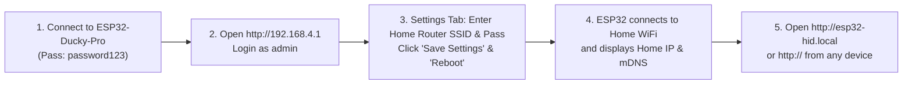

# ESP32-S3 HID Console & KVM Bridge (R8N16)

A professional web-based USB HID injection engine and ultra-low latency KVM bridge built for the **ESP32-S3 N16R8** (16 MB Flash, 8 MB Octal PSRAM).

---

## Table of Contents
- [Highlights & Features](#highlights--features)
- [System Architecture](#system-architecture)
- [Quick Start Guide](#quick-start-guide)
- [Network Access & IP Discovery](#network-access--ip-discovery)
- [Ducky Script Syntax Reference](#ducky-script-syntax-reference)
- [Host KVM Bridge Setup (Windows)](#host-kvm-bridge-setup-windows)
- [Action Recorder & Replay Engine](#action-recorder--replay-engine)
- [Typing Engine Tuning Guide](#typing-engine-tuning-guide)
- [Web OTA Updates](#web-ota-updates)
- [REST API Reference](#rest-api-reference)
- [Security & Reverse Proxy](#security--reverse-proxy)
- [USB Identity Spoofing](#usb-identity-spoofing)

---

## Highlights & Features

- **Dual-Core FreeRTOS Architecture**: Core 1 handles heavy script parsing and 2 MB PSRAM payload streaming, while Core 0 runs real-time USB HID events and UDP network ingestion.
- **Home WiFi & Auto IP Discovery**:
  - Automatically displays assigned Home WiFi IP (Station), Direct AP IP, Gateway, and live RSSI signal strength.
  - Built-in **mDNS responder**: Access directly via **`http://esp32-hid.local`** without knowing numerical IP addresses.
- **Full Ducky Script 2.0 / BadUSB Engine**:
  - Full support for `REPEAT <n>`, `BLOCK...ENDBLOCK` raw text injection, function keys `F1`–`F12`, navigation keys, and compound combinations (`CTRL ALT DELETE`, `CTRL SHIFT ESC`, `ALT F4`, `GUI SHIFT S`).
- **Low-Latency KVM Bridge (16-byte UDP Protocol)**:
  - 16-byte binary UDP protocol for mouse/keyboard/multimedia streaming.
  - Automatic sequence resynchronization on host restart and a 1.5s stuck-key safety watchdog.
- **Virtual Touch 65% Keyboard & Trackpad**:
  - Touch-friendly on-screen keyboard with sticky modifier locks and relative trackpad with scroll gesture.
- **Web-Based OTA Updates**:
  - Flash firmware (`firmware.bin`) and LittleFS filesystems (`littlefs.bin`) directly through the browser without USB cables.
- **Action Recorder & Replay**:
  - Record keyboard and mouse movements from the Web UI or KVM stream, save to `/actions`, and replay at full hardware speed.
- **USB Hardware Spoofing**:
  - Custom Vendor ID, Product ID, Manufacturer Name, and Product Name (with presets for Espressif, Logitech, Microsoft, Arduino, Adafruit).
- **Single-Operator Session & Brute-Force Rate Limiting**:
  - Cookie-based authentication preventing multiple concurrent operators and IP-based exponential backoff rate limiting.

---

## System Architecture

```text
ESP32-S3 Project Structure:
├── boards/
│   └── esp32-s3-devkitc-1-n16r8.json    # Board definition (16MB Flash, 8MB OPI PSRAM)
├── data/                               # LittleFS Web UI Assets
│   ├── app.html                        # Main single-page console UI
│   ├── app.js                          # Web client application logic
│   ├── login.html                      # Single-operator login page
│   └── styles.css                      # Modern dark theme stylesheet
├── server/                             # Host KVM Bridge & Utilities (Python)
│   ├── clipboard_typer.py              # Windows clipboard to HID typer
│   ├── hid_keymap.py                   # WinAPI Virtual-Key to HID mapping
│   ├── preview_http.py                 # Screenshot preview HTTP service
│   ├── protocol.py                     # 16-byte binary UDP protocol
│   ├── server.py                       # Main host KVM capture client
│   ├── state.py                        # Shared state & sequence manager
│   ├── target_screenshot_server.py     # Lightweight screenshot agent
│   ├── udp_sender.py                   # High-rate UDP packet sender
│   └── winapi_hooks.py                 # Low-level WinAPI keyboard/mouse hooks
├── src/
│   └── main.cpp                        # Dual-core firmware source code
├── partitions.csv                      # Partition table (OTA0: 3MB, OTA1: 3MB, LittleFS: 9MB)
├── platformio.ini                      # PlatformIO project configuration
└── README.md                           # Documentation
```

---

## Quick Start Guide

### 1. Build & Flash Firmware (Initial USB Setup)
Connect the ESP32-S3 board to your PC via the **native USB port** and run:

```bash
# 1. Build and flash firmware binary
pio run -t upload

# 2. Upload Web UI files to LittleFS (required)
pio run -t uploadfs
```

### 2. Default Access Credentials
- **Access Point SSID**: `ESP32-Ducky-Pro`
- **AP Password**: `password123`
- **Default AP URL**: `http://192.168.4.1`
- **Default Username**: `admin`
- **Default Password**: `admin123`

---

## Network Access & IP Discovery

Once the device is flashed, you can connect it to your home/office WiFi to access it from any device on your local network.



### Accessing via mDNS (No IP Required)
Because mDNS is built-in, you can open:
```text
http://esp32-hid.local
```
*(Supported natively on Windows 10/11, macOS, iOS, Android, and Linux).*

### Finding the Assigned Home IP
1. In the **Settings** tab, view the **"Device Access & IP Addresses"** dashboard.
2. It displays:
   - **Home WiFi IP (Station)**: The assigned local IP (e.g. `192.168.1.55`) with **Copy Link** and **Open** buttons.
   - **Direct AP IP**: `192.168.4.1` (always available as a direct access point fallback).
   - **Signal & Gateway**: Live WiFi RSSI in dBm and router gateway.
   - **Top Navigation Bar**: Live IP pill in the top-right corner.

---

## Ducky Script Syntax Reference

The onboard interpreter executes scripts from the web editor or directly from `/scripts` in LittleFS.

### Basic Commands
| Command | Description | Example |
| :--- | :--- | :--- |
| `REM` | Comment / remarks (ignored) | `REM This is a comment` |
| `STRING <text>` | Types text with configured typing delay | `STRING Hello World!` |
| `STRINGLN <text>` | Types text followed by Enter | `STRINGLN notepad.exe` |
| `DELAY <ms>` | Pauses execution for $N$ milliseconds | `DELAY 500` |
| `DEFAULT_DELAY <ms>` | Sets delay between every subsequent command | `DEFAULT_DELAY 50` |
| `REPEAT <n>` | Repeats the previous command $n$ times | `REPEAT 5` |
| `BLOCK` ... `ENDBLOCK` | Injects raw text block at maximum throughput | `BLOCK`<br>`Multi-line script`<br>`ENDBLOCK` |
| `MOUSE_MOVE_ABS <x%> <y%>` | Moves cursor to exact screen percentage ($0..100\%$) | `MOUSE_MOVE_ABS 50 50` |
| `MOUSE_CLICK_ABS <btn> <x%> <y%>` | Moves and clicks at exact screen percentage | `MOUSE_CLICK_ABS left 50 50` |

### Special & Navigation Keys
- `ENTER` / `RETURN`
- `TAB`
- `ESC` / `ESCAPE`
- `BACKSPACE`
- `DELETE` / `DEL`
- `INSERT` / `INS`
- `UP` / `DOWN` / `LEFT` / `RIGHT` (or `UPARROW`, `DOWNARROW`, etc.)
- `PAGEUP` / `PAGEDOWN`
- `HOME` / `END`
- `CAPSLOCK` / `NUMLOCK` / `SCROLLLOCK`
- `PRINTSCREEN`
- `PAUSE` / `BREAK`
- `APP` / `MENU`
- `SPACE`
- `F1` through `F12`

### Modifiers & Combinations
Combine modifiers (`CTRL`, `ALT`, `SHIFT`, `GUI` / `WINDOWS`) with any key or function key:

```text
GUI r
DELAY 300
STRINGLN powershell
DELAY 1000
CTRL ALT DELETE
CTRL SHIFT ESC
ALT F4
CTRL+ALT+T
GUI SHIFT S
```

---

## Host KVM Bridge Setup (Windows)

The host bridge captures your keyboard, mouse, and multimedia controls, streaming them to the ESP32 via low-overhead UDP packets.

### Running the KVM Host Client

From the project root:

```bash
# Shared mode (Host input remains active while KVM is toggled ON)
python server/server.py --host 192.168.1.55 --toggle-key f8

# Exclusive mode (Blocks local host input while KVM is ON)
python server/server.py --host 192.168.1.55 --toggle-key f8 --block-local-input

# Enable anti-sleep mouse jiggler
python server/server.py --host 192.168.1.55 --toggle-key f8 --jiggle
```

### Supported Toggle Keys
Configure with `--toggle-key <key>`:
- `f8` (default)
- `f9`
- `f10`
- `f12`
- `pause`
- `scrolllock`

### Target Machine Screenshot Preview Agent
Run on the target computer to provide live screenshots in the Web UI:

```bash
python server/target_screenshot_server.py --port 9988
```
Then enter `http://<TARGET_IP>:9988/screenshot.bmp` in the KVM tab.

---

## Action Recorder & Replay Engine

Record real-time keyboard and mouse events and save them as action files on the ESP32 (`/actions`).

### Action File Format Specification
Files are line-delimited with pipe-separated tokens:

```text
# Delay(ms) | Event Type | Parameters...
0|key_down|128
20|key_tap|114|35
40|key_up|128
100|combo|1|99|40
15|mouse_move|12|-8
50|mouse_scroll|1|0
30|mouse_button|left|click
0|consumer|234
```

### Event Types:
- `key_tap|<code>|<hold_ms>`
- `key_down|<code>`
- `key_up|<code>`
- `key_release_all`
- `combo|<flags>|<code>|<hold_ms>` (Flags bitmask: 1=Ctrl, 2=Alt, 4=Shift, 8=Win)
- `mouse_move|<dx>|<dy>`
- `mouse_scroll|<wheel>|<pan>`
- `mouse_button|<left|right|middle>|<click|down|up>`
- `consumer|<usage_id>`

---

## Typing Engine Tuning Guide

To prevent dropped characters on slow target computers, use the 4 tuning parameters together:

1. **`Typing Delay (ms)`**: Delay between each character (2–6 ms recommended).
2. **`Burst Characters`**: Number of characters sent in a continuous stream (20–30 recommended).
3. **`Burst Pause (ms)`**: Short rest pause after each burst (8–14 ms recommended).
4. **`Newline Pause (ms)`**: Extra delay after Enter/Newline for shells to process (30–50 ms recommended).

| Profile | Typing Delay | Burst Chars | Burst Pause | Newline Pause | Description |
| :--- | :--- | :--- | :--- | :--- | :--- |
| **Reliable** (Default) | `5 ms` | `20` | `14 ms` | `50 ms` | Maximum compatibility across all OSes |
| **High Speed** | `2 ms` | `28` | `8 ms` | `30 ms` | High throughput on fast modern PCs |
| **Slow Target / VM** | `10 ms` | `12` | `20 ms` | `80 ms` | Virtual machines or slow terminals |

---

## Web OTA Updates

You can update firmware or web assets directly through the browser without USB cables.

### Flashing via Web OTA API:

```bash
# Upload new firmware binary
curl -X POST -F "file=@.pio/build/esp32-s3-n16r8/firmware.bin" \
  -H "Cookie: sid=<your-session-cookie>" \
  http://esp32-hid.local/api/ota

# Upload LittleFS filesystem binary
curl -X POST -F "file=@.pio/build/esp32-s3-n16r8/littlefs.bin" \
  -H "Cookie: sid=<your-session-cookie>" \
  "http://esp32-hid.local/api/ota?type=littlefs"
```

---

## REST API Reference

### Authentication & Sessions
- `GET /api/login_status`: Get current login, session lock, and rate limit status.
- `POST /api/login`: Authenticate with `{"user":"admin","pass":"admin123"}`.
- `POST /api/logout`: Invalidate current session cookie.

### Script Execution & Storage
- `GET /api/list`: List all scripts in `/scripts`.
- `GET /api/load?name=demo.txt`: Read script content.
- `POST /api/edit`: Save/upload a script file (multipart).
- `DELETE /api/delete?name=demo.txt`: Delete a script file.
- `POST /api/run`: Stream payload into PSRAM buffer and execute.
- `POST /api/live_text`: Stream raw text into PSRAM and inject.
- `POST /api/stop`: Stop current running script or injection.

### Realtime HID Control
- `POST /api/kbd_event`: Send key tap/down/up (`{"action":"tap","code":176}`).
- `POST /api/live_key`: Quick key tap (`{"code":65,"hold":35}`).
- `POST /api/live_combo`: Key combination (`{"char":"r","gui":true}`).
- `POST /api/mouse_move`: Delta mouse move (`{"dx":10,"dy":-5}`).
- `POST /api/mouse_scroll`: Scroll mouse wheel (`{"wheel":2,"pan":0}`).
- `POST /api/mouse_button`: Mouse click (`{"button":"left","action":"click"}`).
- `POST /api/hid_release_all`: Immediate release of all keys and buttons.

### KVM Bridge & Recordings
- `GET /api/kvm_status`: Get packet counters, sequence, link state, and latency.
- `POST /api/kvm_config`: Configure KVM UDP port and allowed source IP.
- `GET /api/action_files`: List stored action recordings in `/actions`.
- `POST /api/action_file/run?name=macro.txt`: Replay an action file.
- `POST /api/action_file/save?name=macro.txt`: Save recording to `/actions`.
- `DELETE /api/action_file/delete?name=macro.txt`: Delete action file.

### Settings & Device Management
- `GET /api/get_settings`: Retrieve all device settings, network telemetry, and WiFi status.
- `POST /api/save_settings`: Save updated device parameters.
- `POST /api/reboot`: Reboot the ESP32-S3.
- `POST /api/ota`: Upload firmware or filesystem binary.

---

## Security & Reverse Proxy

For internet or remote network access:
1. Do **not** expose the ESP32 port 80 directly to the public internet.
2. Terminate HTTPS on a reverse proxy (e.g. Cloudflare Tunnel, Caddy, Nginx).
3. In **Settings**, enable **Reverse-Proxy Token Auth** and generate a token.
4. Configure your proxy to send:
   - `X-Proxy-Token: <your-token>`
   - `X-Forwarded-Proto: https`

---

## USB Identity Spoofing

The ESP32-S3 allows spoofing USB device descriptors before `USB.begin()` on boot:
- **Vendor Name** (e.g. `Logitech`, `Microsoft`, `Apple`)
- **Product Name** (e.g. `USB Optical Mouse`, `Standard 101/102-Key Keyboard`)
- **Vendor ID (VID)** (e.g. `0x046D` for Logitech)
- **Product ID (PID)** (e.g. `0xC077`)

Configure these in the **Settings** tab, save, and reboot the device to apply.
