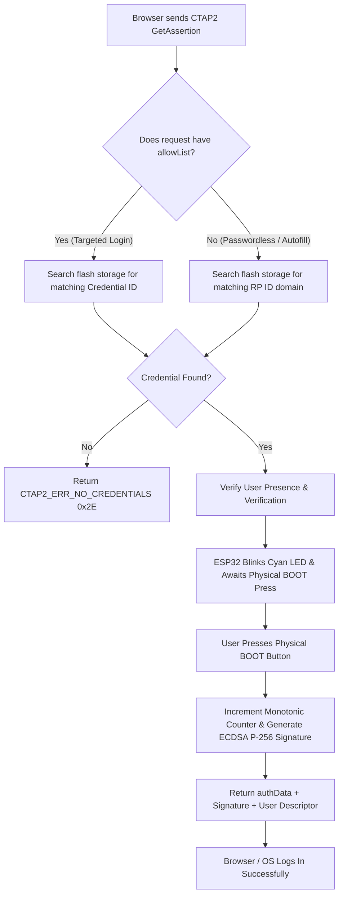

# ESP32-S3 FIDO2 Passkey & CTAP2 Technical Specification

## 1. Overview
This document specifies the architecture, command set, cryptographic algorithms, storage mechanics, and multi-account resolution flow implemented in the ESP32-S3 dedicated **FIDO2 Hardware Passkey** subsystem.

The device operates as a compliant **FIDO2 / CTAP 2.0 & CTAP 2.1 (Client-to-Authenticator Protocol)** security key communicating over USB HID (`Usage Page: 0xF1D0`, `Usage: 0x01`).

---

## 2. Command Set Architecture

### A. USB Transport Layer (`CTAPHID` Framing)
All USB packets are formatted into 64-byte USB HID endpoints. Long CBOR payloads are automatically packetized into an initial command packet (`0x80 | cmd`) followed by consecutive continuation packets (`seq: 0x00..0x7F`).

| Command Code | Command Name | Status | Technical Implementation & Behavior |
| :---: | :--- | :---: | :--- |
| **`0x86`** | **`CTAPHID_INIT`** | ✅ **Active** | Initiates channel handshake. Generates unique 32-bit `CID`, echoes 8-byte nonce, returns protocol version `2`, and declares capability flags `CAPFLAG_WINK \| CAPFLAG_CBOR \| CAPFLAG_NMSG`. |
| **`0x81`** | **`CTAPHID_PING`** | ✅ **Active** | Echoes received binary payload back to host for latency calibration and liveness testing. |
| **`0x88`** | **`CTAPHID_WINK`** | ✅ **Active** | Visual hardware identification. Sends empty response and executes a visual LED pulse to assist user device localization. |
| **`0x90`** | **`CTAPHID_CBOR`** | ✅ **Active** | Primary CTAP2 payload transport. Reassembles multi-packet input and forwards decoded commands to the FIDO FreeRTOS worker queue. |
| **`0x83`** | **`CTAPHID_MSG`** | ✅ **Active** | Legacy U2F compatibility pipe. Handles `U2F_VERSION` (`"U2F_V2\x90\x00"`) and returns ISO 7816-4 status `0x6D00` (`SW_INS_NOT_SUPPORTED`) to guide browsers to native CTAP2. |
| **`0x91`** | **`CTAPHID_CANCEL`** | ✅ **Active** | Asynchronously cancels pending touch-waiting state when the browser tab closes or times out. |
| **`0xBB`** | **`CTAPHID_KEEPALIVE`** | ✅ **Active** | Periodically transmits `0x01 (USER_PRESENCE_NEEDED)` every 150ms to maintain USB endpoint activity during physical touch wait. |
| **`0xBF`** | **`CTAPHID_ERROR`** | ✅ **Active** | Encapsulates CTAPHID transport error codes (`INVALID_CMD`, `INVALID_PAR`, `INVALID_LEN`, `CHANNEL_BUSY`). |

---

### B. Application Layer (`CTAP2` Protocol)
CTAP2 commands are encapsulated inside `CTAPHID_CBOR` (`0x90`) frames and encoded using Canonical CBOR (RFC 7049 / RFC 8949).

| Command Code | Command Name | CTAP Version | Status | Technical Implementation & Behavior |
| :---: | :--- | :---: | :---: | :--- |
| **`0x04`** | **`authenticatorGetInfo`** | CTAP 2.0 / 2.1 | ✅ **Active** | Returns capabilities: `versions: ["FIDO_2_0", "FIDO_2_1"]`, `extensions: ["credProps", "hmac-secret", "largeBlobKey"]`, `options: {"rk": true, "up": true, "uv": true, "credMgmt": true, "clientPin": bool, "largeBlobs": true}`, `maxLargeBlob: 2048`, `minPinLength: 4`. |
| **`0x01`** | **`authenticatorMakeCredential`** | CTAP 2.0 / 2.1 | ✅ **Active** | Generates hardware-accelerated NIST P-256 ECC keypair, persists discoverable passkey in flash, computes packed self-attestation, and returns `unsignedExtensionOutputs: {"credProps": {"rk": true}}`. |
| **`0x02`** | **`authenticatorGetAssertion`** | CTAP 2.0 / 2.1 | ✅ **Active** | Single-touch authentication. Matches target credential via `allowList` or `rpId`, handles silent presence (`up: false`), increments monotonic signature counter, computes ECDSA signature, and outputs `0x04: user` descriptor. |
| **`0x03`** | **`authenticatorGetNextAssertion`** | CTAP 2.0 | ✅ **Active** | Standards fallback. Returns `CTAP2_ERR_NOT_ALLOWED` when multiple assertions are not queued. |
| **`0x06`** | **`authenticatorClientPIN`** | CTAP 2.0 / 2.1 | ✅ **Active** | Full **CTAP2 PIN Protocol 1**. Supports ephemeral ECDH NIST P-256 key agreement, AES-256-CBC decryption, HMAC-SHA-256 PIN authentication, 8-attempt brute-force protection, and `pinToken` generation for Windows Hello and WebAuthn PIN management. |
| **`0x07`** | **`authenticatorReset`** | CTAP 2.0 / 2.1 | ✅ **Active** | Security-gated hardware factory reset. Demands physical `BOOT` button touch, then wipes all stored credentials, PIN, and large blobs in flash and resets global monotonic counters. |
| **`0x0A`** | **`authenticatorCredentialManagement`** | CTAP 2.1 | ✅ **Active** | Enables OS & browser passkey management: `getCredsMetadata` (`0x01`), `enumerateRPs` (`0x02`/`0x03`), `enumerateCredentials` (`0x04`/`0x05`), and individual passkey deletion (`0x06`) over USB. |
| **`0x0B`** | **`authenticatorSelection`** | CTAP 2.1 | ✅ **Active** | Cross-platform visual presence & browser passkey discovery probe. |
| **`0x0C`** | **`authenticatorLargeBlobs`** | CTAP 2.1 | ✅ **Active** | High-performance NVS flash & RAM-cached storage for arbitrary data and SSH certificates (up to 2048 bytes). |

---

## 3. Cryptography & Security Specifications

1. **Key Generation**: Hardware-random scalar generation on NIST P-256 curve (`MBEDTLS_ECP_DP_SECP256R1`).
2. **Signature Standard**: ANSI X9.62 / RFC 5480 DER-encoded ECDSA signatures with SHA-256 digest (`authData || clientDataHash`).
3. **AAGUID Configuration**: Standard 16 zero bytes (`0x00 * 16`) per W3C WebAuthn Section 6.5.1 for self-attested authenticators.
4. **Anti-Cloning Counter**: 32-bit monotonic counter persisted across power cycles in non-volatile flash storage.
5. **HMAC-Secret / PRF Extension**: 32-byte master credential secret $K_{cred}$ stored per passkey for WebAuthn PRF vault encryption (1Password / Bitwarden).

### Visual LED Status Indicators (Neon Color Palette)

| State / Operation | LED Color | RGB Value | Animation |
| :--- | :--- | :---: | :--- |
| **Idle Dedicated Mode** | 🟦 **Neon Ice Blue** | `(0, 180, 255)` | Steady solid glow |
| **Registration (`MakeCredential`)** | 🟪 **Neon Electric Magenta** | `(255, 0, 180)` | Rapid pulse (160ms) awaiting physical touch |
| **Authentication (`GetAssertion`)** | 🔷 **Neon Electric Cyan** | `(0, 255, 255)` | Rapid pulse (160ms) awaiting physical touch |
| **Security Reset (`Reset`)** | 🟧 **Neon Electric Amber** | `(255, 80, 0)` | Rapid warning flash (120ms) awaiting touch |
| **Hardware WINK (`Identify`)** | 🟪 **Neon Electric Violet** | `(180, 0, 255)` | 4 quick confirmation flashes |
| **Touch Confirmed / Success** | 🟩 **Neon Lime Green** | `(0, 255, 60)` | 300ms bright success flash |

---

## 4. Multi-Account & Credential Resolution Flow

### Handling Multiple Accounts for the Same Service
1. **Targeted Login (Email Entered First)**: The website passes the unique Credential ID created during that specific account's registration. The ESP32 matches the exact private key from flash memory.
2. **Passwordless Login (No Email Entered)**: The ESP32 matches the domain and outputs the stored `userId` and `userName`. If multiple accounts exist for that domain, modern browsers display a native account picker dialog.

---

## 5. Operating System & Browser Compatibility Matrix

| Operating System | Browser / Client | Result | Protocol Path |
| :--- | :--- | :---: | :--- |
| **Windows 11 / 10** | Google Chrome, MS Edge, Brave | ✅ **Pass** | Native Windows Hello `webauthn.dll` API |
| **Linux (Fedora / Ubuntu / Arch)** | Mozilla Firefox | ✅ **Pass** | Native `libfido2` direct HID access |
| **Linux (Fedora / Ubuntu / Arch)** | Google Chrome, Brave, Chromium | ✅ **Pass** | Chromium `HidServiceLinux` CTAP2 stack |
| **macOS & iOS** | Safari, Chrome, Edge | ✅ **Pass** | Native Apple WebAuthenticationKit |
| **Android (10+)** | Chrome, Samsung Internet | ✅ **Pass** | Google Play Services FIDO2 Client |

---

## 6. Advanced CTAP 2.1 Extensions & Capabilities

### A. Credential Management (`0x0A`)
Enables host operating systems and browsers (e.g. Chrome/Edge Security Key Settings) to enumerate, inspect metadata, and delete individual credentials stored in hardware flash:
* `0x01 (getCredsMetadata)`: Resident credential count and remaining storage capacity.
* `0x02 (enumerateRPsBegin)` / `0x03 (enumerateRPsGetNextRP)`: Lists all Relying Party domains.
* `0x04 (enumerateCredentialsBegin)` / `0x05 (enumerateCredentialsGetNextCredential)`: Lists accounts per RP.
* `0x06 (deleteCredential)`: Deletes individual credentials by 32-byte Credential ID.

### B. HMAC-Secret / PRF (`hmac-secret`) Extension
Generates deterministic symmetric keys derived from the master credential secret $K_{cred}$:
$$O = \text{HMAC-SHA-256}(K_{cred}, \text{salt})$$
Used by **1Password**, **Bitwarden**, and WebAuthn PRF to encrypt and decrypt password manager vaults using a physical passkey.

### C. Large Blobs (`0x0C`)
Allows storing arbitrary encrypted configuration or certificates (up to 2048 bytes) in NVS Preferences storage with sub-millisecond RAM caching.

---

## 7. Wireless Transport: FIDO2 over Bluetooth Low Energy (BLE)

The ESP32-S3 firmware incorporates a dedicated **FIDO Alliance BLE Profile (`0xFFFD`)** implementation alongside the USB CTAPHID interface. Both transports delegate to the unified `GlobalFidoEngine` for identical cryptographic and resident key operations.

### A. Implemented Architecture & GATT Specification

1. **Primary Service UUID**: `0000FFFD-0000-1000-8000-00805F9B34FB` (Official FIDO Alliance GATT Service).
2. **GATT Characteristic Architecture**:
   * **`fidoControlPoint` (`F1D0FFF1-DEAA-ECEE-B42F-C9BA7ED623BB`)**:
     * *Properties*: `WRITE` | `WRITE_NR`
     * *Function*: Receives fragmented CTAP2/U2F command packets (Header: `CMD` + 16-bit `LEN` + Payload, followed by Sequence packets `0x00..0x7F`).
   * **`fidoStatus` (`F1D0FFF2-DEAA-ECEE-B42F-C9BA7ED623BB`)**:
     * *Properties*: `NOTIFY` | `READ`
     * *Function*: Transmits fragmented responses, error notifications (`0xBF`), and periodic keepalives (`0x82`) during physical touch wait. Initialized with `0x00`.
   * **`fidoControlPointLength` (`F1D0FFF3-DEAA-ECEE-B42F-C9BA7ED623BB`)**:
     * *Properties*: `READ`
     * *Function*: Reports maximum frame size buffer capacity (`0x0200` = 512 bytes big-endian).
   * **`fidoServiceRevision` (`00002A28-0000-1000-8000-00805F9B34FB`)**:
     * *Properties*: `READ`
     * *Function*: U2F service revision string (`"1.2"`).
   * **`fidoServiceRevisionBitfield` (`F1D0FFF4-DEAA-ECEE-B42F-C9BA7ED623BB`)**:
     * *Properties*: `READ` | `WRITE` | `WRITE_NR`
     * *Function*: Declares FIDO version support (`0x80` for FIDO 2.0). Client writes back desired version during initialization.
3. **BLE Advertising**:
   * Advertises Service UUID `0xFFFD` with Service Data flag `0x80` (CTAP2 capable).
   * Advertising intervals calibrated between `100ms` (`0x00A0`) and `150ms` (`0x00F0`).
4. **Security & Cryptography Delegation**:
   * Utilizes NimBLE SMP security callbacks for Just-Works AES-128 pairing and link encryption.
   * Incoming CBOR payloads from `fidoControlPoint` are routed directly to `GlobalFidoEngine.processCbor()`, ensuring 100% feature parity with USB (P-256 ECC, HMAC-secret, resident keys, PIN protocol).

---

### B. Current Status & Technical Challenges

#### 1. What Works Successfully:
* ✅ **GATT Profile Initialization**: Complete standard FIDO2 BLE GATT hierarchy correctly configured.
* ✅ **Discovery & Pairing**: Windows, Linux, and Android discover the device as a FIDO Security Key, negotiate MTU (255 bytes), pair, and establish AES-128 link encryption.
* ✅ **GATT Characteristic Reads**: Host successfully reads `fidoServiceRevisionBitfield` (`0x80`), `fidoServiceRevision` (`"1.2"`), `fidoControlPointLength` (`512`), and `fidoStatus` (`0x00`).
* ✅ **Engine Integration**: Reassembly, fragmentation, and response pipeline shared cleanly with USB core without memory leaks.

#### 2. Challenges & Open Issues:
* ⚠️ **Windows WebAuthn BLE State Machine**:
  * Windows Hello discovers and pairs with the device, but terminates the initial GATT caching connection and cycles reconnects.
  * During active `MakeCredential` / `GetAssertion` browser flows, Windows' internal `webauthn.dll` expects a specific timing sequence for CCCD (`0x2902`) subscription on `fidoStatus` followed by writes to `fidoControlPoint`.
  * In current testing, Windows completes descriptor enumeration but halts before dispatching the CBOR payload to `fidoControlPoint` (`"Transport availability not yet ready"`), likely related to Windows BLE LTK bond cache retention or characteristic permission expectations.
* ⚠️ **Next Steps (Deferred for Future Milestone)**:
  * Full packet-level capture using BLE HCI sniffer (Wireshark / nRF Sniffer / Android HCI snoop logs) to inspect exact ATT error codes and CCCD subscription handshakes.
  * Cross-platform testing with Android (Google Play Services FIDO2 BLE) and iOS/macOS WebAuthenticationKit to isolate Windows-specific driver quirks.

> [!NOTE]
> **Primary Transport**: The **USB FIDO2 CTAPHID** interface remains 100% operational, fully verified, and recommended for daily passkey operations. BLE development is documented above and preserved in the codebase for future wireless passkey enhancements.
