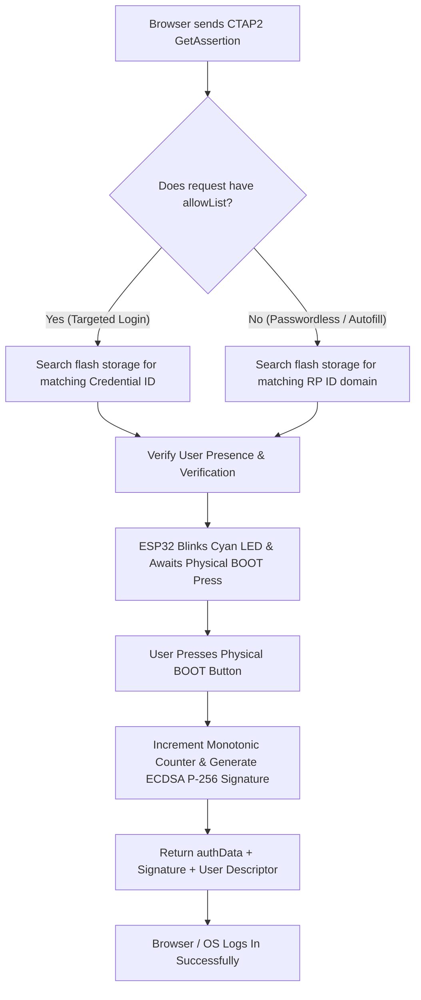

# ESP32-S3 FIDO2 Passkey & CTAP2 Technical Specification

## 1. Overview
This document specifies the architecture, command set, cryptographic algorithms, and multi-account resolution flow implemented in the ESP32-S3 dedicated **FIDO2 Hardware Passkey** subsystem.

The device operates as a compliant **FIDO2 / CTAP2 (Client-to-Authenticator Protocol)** security key communicating over USB HID (`Usage Page: 0xF1D0`, `Usage: 0x01`).

---

## 2. Command Set Architecture

### A. USB Transport Layer (`CTAPHID` Framing)
All USB packets are formatted into 64-byte USB HID endpoints. Long CBOR payloads are automatically packetized into an initial command packet (`0x80 | cmd`) followed by consecutive continuation packets (`seq: 0x00..0x7F`).

| Command Code | Command Name | Status | Technical Implementation & Behavior |
| :---: | :--- | :---: | :--- |
| **`0x86`** | **`CTAPHID_INIT`** | ✅ **Active** | Initiates channel handshake. Generates unique 32-bit `CID`, echoes 8-byte nonce, returns protocol version `2`, and declares capability flags `CAPFLAG_WINK \| CAPFLAG_CBOR \| CAPFLAG_NMSG`. |
| **`0x81`** | **`CTAPHID_PING`** | ✅ **Active** | Echoes received binary payload back to host for latency calibration and liveness testing. |
| **`0x88`** | **`CTAPHID_WINK`** | ✅ **Active** | Visual hardware identification. Sends empty response and executes a visual LED pulse to assist user device localization. |
| **`0x90`** | **`CTAPHID_CBOR`** | ✅ **Active** | Primary CTAP2 payload transport. Reassembles multi-packet input and forwards decoded commands to the FIDO FreeRTOS worker queue. |
| **`0x83`** | **`CTAPHID_MSG`** | ✅ **Active** | Legacy U2F compatibility pipe. Handles `U2F_VERSION` (`"U2F_V2\x90\x00"`) and returns ISO 7816-4 status `0x6D00` (`SW_INS_NOT_SUPPORTED`) to guide browsers to native CTAP2. |
| **`0x91`** | **`CTAPHID_CANCEL`** | ✅ **Active** | Asynchronously cancels pending touch-waiting state when the browser tab closes or times out. |
| **`0xBB`** | **`CTAPHID_KEEPALIVE`** | ✅ **Active** | Periodically transmits `0x01 (USER_PRESENCE_NEEDED)` every 150ms to maintain USB endpoint activity during physical touch wait. |
| **`0xBF`** | **`CTAPHID_ERROR`** | ✅ **Active** | Encapsulates CTAPHID transport error codes (`INVALID_CMD`, `INVALID_PAR`, `INVALID_LEN`, `CHANNEL_BUSY`). |

---

### B. Application Layer (`CTAP2` Protocol)
CTAP2 commands are encapsulated inside `CTAPHID_CBOR` (`0x90`) frames and encoded using Canonical CBOR (RFC 7049 / RFC 8949).

| Command Code | Command Name | Status | Technical Implementation & Behavior |
| :---: | :--- | :---: | :--- |
| **`0x04`** | **`authenticatorGetInfo`** | ✅ **Active** | Returns authenticator capabilities: `versions: ["FIDO_2_0"]`, `extensions: ["credProps"]`, `aaguid: 0x00*16`, `options: {"rk": true, "up": true, "uv": true}`, `maxMsgSize: 1024`, `transports: ["usb"]`. |
| **`0x01`** | **`authenticatorMakeCredential`** | ✅ **Active** | Generates hardware-accelerated NIST P-256 ECC keypair, persists discoverable passkey in LittleFS, computes packed self-attestation, and returns `unsignedExtensionOutputs: {"credProps": {"rk": true}}`. |
| **`0x02`** | **`authenticatorGetAssertion`** | ✅ **Active** | Single-touch authentication. Matches target credential via `allowList` or `rpId`, increments global monotonic signature counter, computes ECDSA signature, and outputs `0x04: user` descriptor for instant account resolution. |
| **`0x03`** | **`authenticatorGetNextAssertion`** | ✅ **Active** | Standards fallback. Returns `CTAP2_ERR_NOT_ALLOWED` when multiple assertions are not queued. |
| **`0x06`** | **`authenticatorClientPIN`** | ✅ **Active** | Standard options check. Returns `CTAP2_ERR_UNSUPPORTED_OPTION` since built-in User Verification (`uv: true`) handles verification without PIN. |
| **`0x07`** | **`authenticatorReset`** | ✅ **Active** | Security-gated hardware factory reset. Demands physical `BOOT` button touch, then wipes all stored credentials in flash and generates a fresh global counter. |

---

## 3. Cryptography & Security Specifications

1. **Key Generation**: Hardware-random scalar generation on NIST P-256 curve (`MBEDTLS_ECP_DP_SECP256R1`).
2. **Signature Standard**: ANSI X9.62 / RFC 5480 DER-encoded ECDSA signatures with SHA-256 digest (`authData || clientDataHash`).
3. **AAGUID Configuration**: Standard 16 zero bytes (`0x00 * 16`) per W3C WebAuthn Section 6.5.1 for self-attested authenticators.
4. **Anti-Cloning Counter**: 32-bit monotonic counter persisted across power cycles in non-volatile flash storage.
### Visual LED Status Indicators (Neon Color Palette)

| State / Operation | LED Color | RGB Value | Animation |
| :--- | :--- | :---: | :--- |
| **Idle Dedicated Mode** | 🟦 **Neon Ice Blue** | `(0, 180, 255)` | Steady solid glow |
| **Registration (`MakeCredential`)** | 🟪 **Neon Electric Magenta** | `(255, 0, 180)` | Rapid pulse (160ms) awaiting physical touch |
| **Authentication (`GetAssertion`)** | 🔷 **Neon Electric Cyan** | `(0, 255, 255)` | Rapid pulse (160ms) awaiting physical touch |
| **Security Reset (`Reset`)** | 🟧 **Neon Electric Amber** | `(255, 80, 0)` | Rapid warning flash (120ms) awaiting touch |
| **Hardware WINK (`Identify`)** | 🟪 **Neon Electric Violet** | `(180, 0, 255)` | 4 quick confirmation flashes |
| **Touch Confirmed / Success** | 🟩 **Neon Lime Green** | `(0, 255, 60)` | 300ms bright success flash |

---

## 4. Multi-Account & Credential Resolution Flow

### Handling Multiple Accounts for the Same Service
1. **Targeted Login (Email Entered First)**: The website passes the unique Credential ID created during that specific account's registration. The ESP32 matches the exact private key from flash memory.
2. **Passwordless Login (No Email Entered)**: The ESP32 matches the domain and outputs the stored `userId` and `userName`. If multiple accounts exist for that domain, modern browsers display a native account picker dialog.

---

## 5. Operating System & Browser Compatibility Matrix

| Operating System | Browser / Client | Result | Protocol Path |
| :--- | :--- | :---: | :--- |
| **Windows 11 / 10** | Google Chrome, MS Edge, Brave | ✅ **Pass** | Native Windows Hello `webauthn.dll` API |
| **Linux (Fedora / Ubuntu / Arch)** | Mozilla Firefox | ✅ **Pass** | Native `libfido2` direct HID access |
| **Linux (Fedora / Ubuntu / Arch)** | Google Chrome, Brave, Chromium | ✅ **Pass** | Chromium `HidServiceLinux` CTAP2 stack |
| **macOS & iOS** | Safari, Chrome, Edge | ✅ **Pass** | Native Apple WebAuthenticationKit |
| **Android (10+)** | Chrome, Samsung Internet | ✅ **Pass** | Google Play Services FIDO2 Client |
