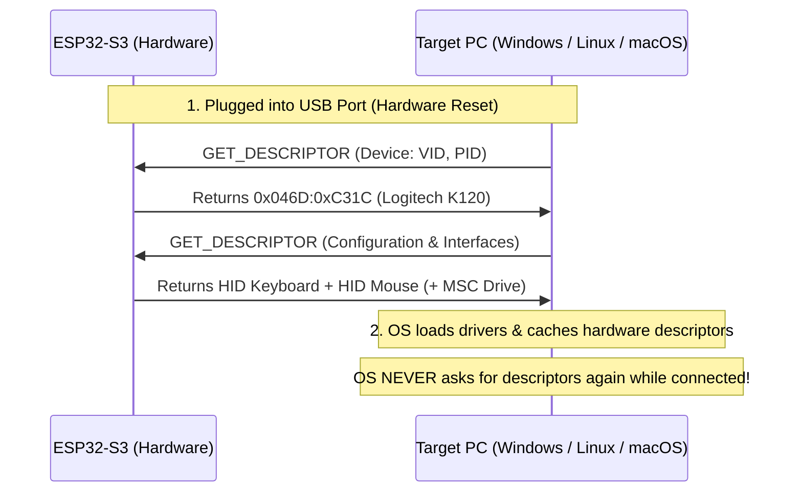

# ESP32-S3 HID Console: Settings & Reboot Guide

This document explains **which settings apply instantly in real time**, **which settings require a reboot**, and the **hardware / operating system reasons why**.

---

## 📊 Quick Reference Matrix

| Setting Category | Specific Settings | Reboot Required? | Why / How It Works |
| :--- | :--- | :---: | :--- |
| **Typing Engine** | Typing Delay, Burst Characters, Burst Pause, Line Delay | ❌ **No (Instant)** | Applied immediately to RAM variables used by the keystroke injection engine. |
| **Hardware LED** | LED Brightness (0–255) | ❌ **No (Instant)** | Directly updates the NeoPixel PWM duty cycle via `pixels.setBrightness()`. |
| **Mouse / Stylus** | Mouse Smoothness, Absolute Crosshair Scaling | ❌ **No (Instant)** | Coordinates and smoothing factors are calculated dynamically per motion packet. |
| **Security & Auth** | Admin Username, Admin Password, Login Rate Limit, Proxy Token | ❌ **No (Instant)** | Verified live in RAM on every HTTP request. |
| **KVM UDP Bridge** | UDP Port, Allowed Host IP, KVM Enable Toggle | ❌ **No (Instant)** | The firmware closes the previous UDP socket and re-binds to the new port live. |
| **Vault & 2FA** | 2FA TOTP Seeds, Password Vault Entries, Master Pass | ❌ **No (Instant)** | Encrypted with AES-256-GCM and written directly to `/vault.enc`. |
| **WiFi Network** | Connecting to new Home Router (STA) or changing Hotspot SSID | ⚠️ **Yes (Recommended)** | Reconnects DHCP, DNS resolver, and mDNS responder cleanly across the network. |
| **USB Identity** | Vendor ID (VID), Product ID (PID), Vendor Name, Product Name | ⚠️ **Yes (Required)** | **USB Hardware Enumeration**: Host OS (Windows/Linux/macOS) only reads USB device descriptors once when plugged in. |
| **USB Mass Storage** | Enable / Disable Virtual Flash Drive (`DUCKY_DRIVE`) | ⚠️ **Yes (Required)** | Requires USB Host Controller to re-enumerate USB Interface Descriptors and re-mount the SCSI disk. |

---

## 🔍 Why Does USB Identity Require a Reboot?



1. **Hardware USB Bus Enumeration**:
   * When a USB device is plugged in, the host operating system performs a low-level handshake called **Enumeration**.
   * The OS asks for the **Device Descriptor**, **Configuration Descriptor**, and **Interface Descriptors** (Keyboard, Mouse, Mass Storage).
   * Once read, the OS **caches these descriptors in kernel memory** and attaches the appropriate device drivers.

2. **Why dynamic USB switching without a reboot is unsafe**:
   * If the ESP32 changed its Vendor ID or added a Mass Storage disk while still plugged into the bus without a physical disconnect or bus reset, the host OS kernel would throw `USB_DEVICE_DESCRIPTOR_FAILURE` or crash the driver stack.
   * On reboot, the ESP32 performs a clean USB D+/D- bus pull-down reset, causing the target PC to cleanly discover the new hardware identity!

---

## ⚡ How the Smart Settings Engine Works

When you click **"Save Settings"** in the Web Console:

```mermaid
flowchart TD
    A["You Click 'Save Settings'"] --> B["ESP32 compares old vs new settings in RAM"]
    B --> C["Saves configuration to Dual-Layer Storage (LittleFS + Hardware NVS)"]
    B --> D{"Were USB Identity or WiFi changed?"}
    D -->|No (Only Timing, LED, KVM, Auth)| E["✅ UI Displays: 'Settings applied live in real-time! (No reboot needed)'"]
    D -->|Yes (VID/PID, MSC, WiFi)| F["⚠️ UI Displays: 'Settings saved to NVS! Reboot required to apply new USB descriptors'"]
```

1. **Zero-Downtime Application**:
   * If you only adjust typing delay, LED brightness, or KVM settings, they take effect **within 1 millisecond with zero device restart**.
2. **Persistent Hardware NVS Flash**:
   * All settings are permanently mirrored to the hardware **NVS partition**, meaning your configurations will survive reboots, power cuts, and even complete LittleFS filesystem re-flashes!
